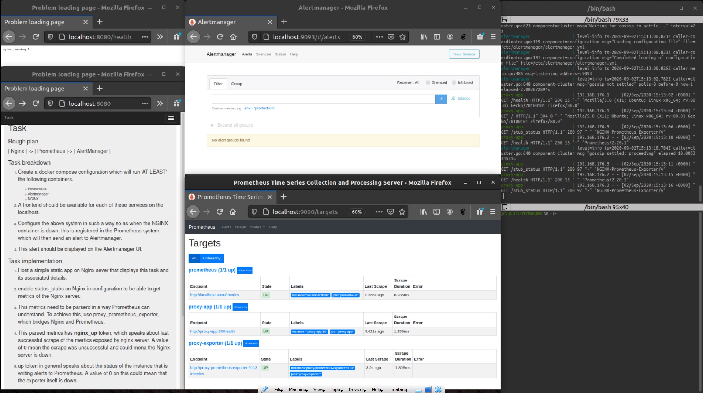

### Rough plan

| Nginx  | -> | Prometheus  |-> | AlertManager  |

### Task breakdown 

1. Create a docker compose configuration which will run 'AT LEAST' the following containers.

     * Prometheus
     * Alertmanager
     * NGINX

2. A frontend should be available for each of these services on the localhost.

3. Configure the above system in such a way so as when the NGINX container is down, this is registered in the Prometheus system, which will then send an alert to Alertmanager. 

4. This alert should be displayed on the Alertmanager UI.

### Task implementation Plan
1. Host a simple static app on Nginx sever that displays this task and its associated details.

2. Enable status_stubs on Nginx in configuration to be able to get metrics of the Nginx server.

3. This metrics need to be parserd in a way Prometheus can understand. To achieve this, use proxy_prometheus_exporter, which bridges Nginx and Prometheus.

4. This parsed metrics has **nginx_up** token, which speaks about last successful scrape of the mertics exposed by nginx server. A value of 0 mean the scrape was unsuccessful and could mean the Nginx server is down.

5. **up** token in general speaks about the status of any instance that is configured to Prometheus. A value of 0 on this means that istance is down.

6. It is also possible to stub a health endpoint on nginx server and serve a simple atrig that is acceptable by prometheus. This end point can be configured to prometheus to know if the server is down. Whith out this stub it is not possible to configure Nginx to prometheus directly.

6. Based on **nginx_up** and **up** and **nginx_running** (stubbed) tokens set up rules to fire alerts to alert manager about Nginx and exporter respectively.
   
### Build instrucions

1. clone this repo
2. at the repo root run   `docker-compose up`
3. open browser and check 
   1. localhost:8080 for app hosted on nginx 
   2. localhost:9113/metrics for looking at parsed metrics exposed by nginx on /stub_status
   3. localhost:9090/alerts for prometheus alerts
   4. localhost:9093 for alertmanger
   
   
   

### Test instructions

1. after successful build
2. at the repo root run `docker container stop proxy-app`
3. This will stop the nginx container 
   
4. This is captured by prometheus.
   
5. This phenomenon creates two alerts.
   1. Instance down as th Nginx server is Down.
   2. Scrape faiulre alert as there were no metrics to scrape 
   
6. After 15-30 seconds (these values are used to the alert quicly) one can observer event been calculated at prometheus and fired to alert manager.
   
7. Can observe the similar alert for `docker container stop proxy-prometheus-expo` 
   Note: stopping proxy-prometheus-expo container will result in scrape failure alert only.

### clean up
   
1. At the repo root run   `docker-compose down`

### Resources:
1. inspiration : https://github.com/g00glen00b/movie-quote-app/blob/master/docker-compose.yml
2. https://github.com/nginxinc/nginx-prometheus-exporter
3. https://github.com/docker-library/docs/tree/master/nginx
4. prometheus.io
5. Udemy courses:
   * https://www.udemy.com/course/docker-mastery/
   * https://www.udemy.com/course/monitoring-and-alerting-with-prometheus/