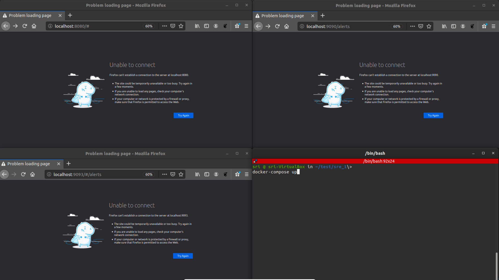
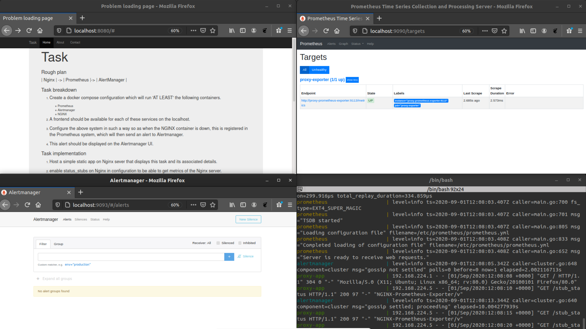
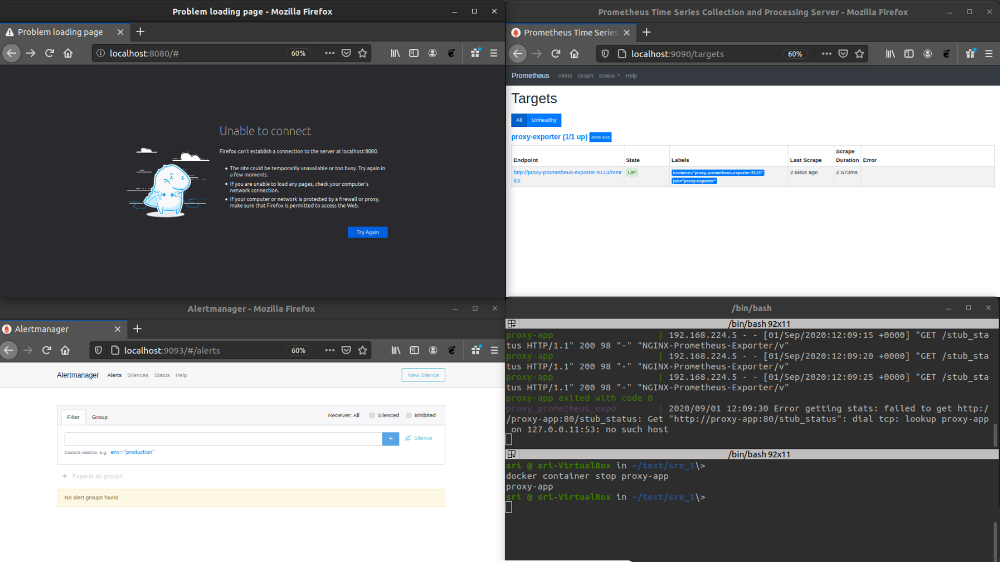
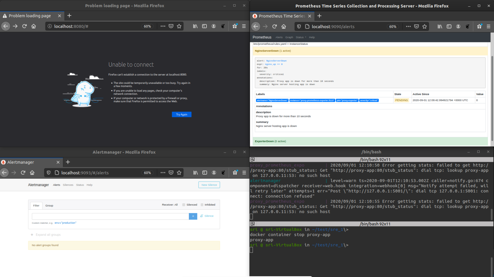
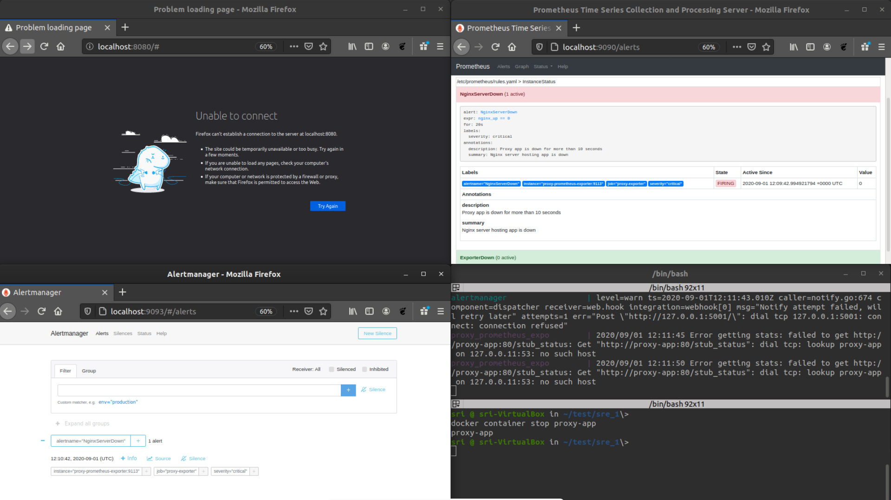
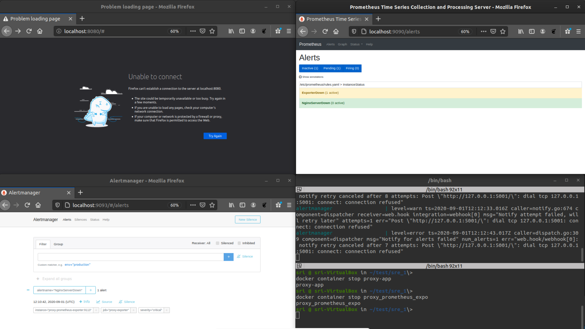
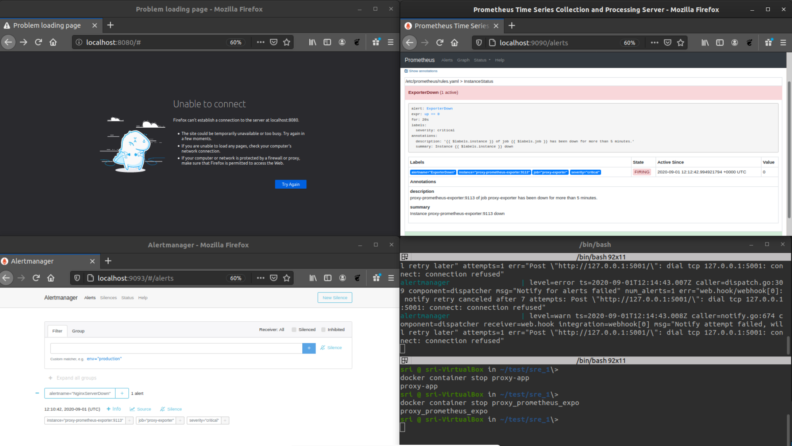
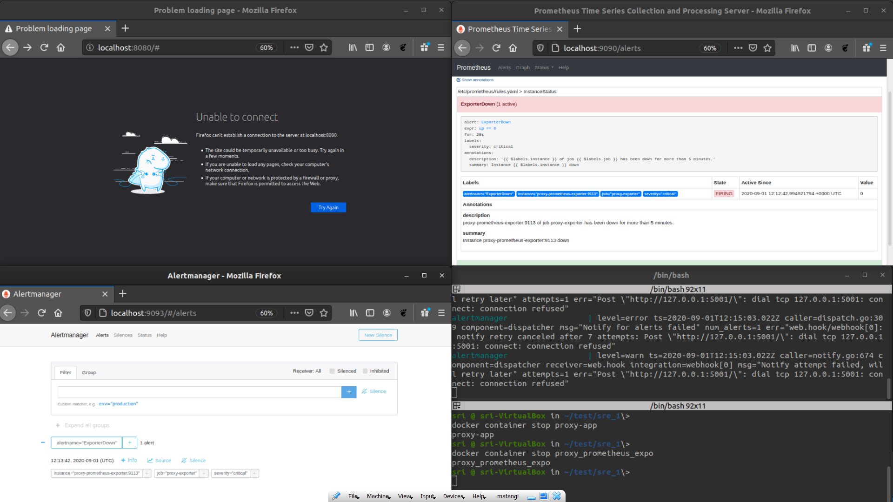

### Rough plan

| Nginx  | -> | Prometheus  |-> | AlertManager  |

### Task breakdown 

1. Create a docker compose configuration which will run 'AT LEAST' the following containers.

     * Prometheus
     * Alertmanager
     * NGINX

2. A frontend should be available for each of these services on the localhost.

3. Configure the above system in such a way so as when the NGINX container is down, this is registered in the Prometheus system, which will then send an alert to Alertmanager. 

4. This alert should be displayed on the Alertmanager UI.

### Task implementation Plan
1. Host a simple static app on Nginx sever that displays this task and its associated details.

2. enable status_stubs on Nginx in configuration to be able to get metrics of the Nginx server.

3. This metrics need to be parserd in a way Prometheus can understand. To achieve this, use proxy_prometheus_exporter, which bridges Nginx and Prometheus.

4. This parsed metrics has **nginx_up** token, which speaks about last successful scrape of the mertics exposed by nginx server. A value of 0 mean the scrape was unsuccessful and could mena the Nginx server is down.

5. up token in general speaks about the status of the instance that is writing alerts to Prometheus. A value of 0 on this could mean that the exporter itself is down.

6. Based on nginx_up and up tokens set up rules to fire alerts to alert manager  about Nginx and exporter  respectively.
   
### Build instrucions

1. clone this repo
2. at the repo root run   `docker-compose up`
3. open browser and check 
   1. localhost:8080 for app hosted on nginx 
   2. localhost:9113/metrics for looking at parsed metrics exposed by nginx on /stub_status
   3. localhost:9090/alerts for prometheus alerts
   4. localhost:9093 for alertmanger

### Test instructions

1. after successful buid
2. at the repo root run `dockrer container stop proxy-app`
3. This will stop the nginx container 
4. after a minute once can observer event been calculated at prometheus an fired to alert manager.
5. can obser ve the similar aler for `dockrer container stop proxy_prometheus_expo`

### Resources:
1. inspiration : https://github.com/g00glen00b/movie-quote-app/blob/master/docker-compose.yml
2. https://github.com/nginxinc/nginx-prometheus-exporter
3. https://github.com/docker-library/docs/tree/master/nginx
4. prometheus.io
5. Udemy courses:
   * https://www.udemy.com/course/docker-mastery/
   * https://www.udemy.com/course/monitoring-and-alerting-with-prometheus/